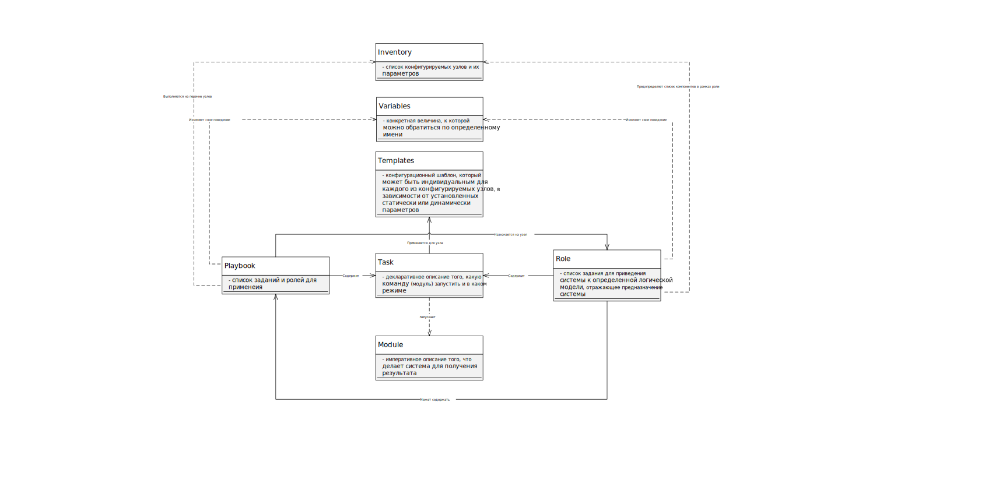

# Особенности архитектуры

- Ansible оперирует едиными **заданиями** (task) - требование что-то выполнить, перевести систему из одного состояния в другое, атомарное действие.

- Каждое из заданий запускает определенный **модуль** (module) с параметрами - именно в модуле содержится вся логика работы Ansible.

- Задания сгруппированы в **роли** (role) - набор заданий, который может быть переиспользован множество раз на произвольном количестве машин.

- Последовательность запуска заданий и применения ролей может быть скомбинирована в **список для выполнения** (playbook)

- Для того, чтобы определить, на каких узлах запускать playbook-и, используется **инвентаризационный файл** (inventory) - описываются узлы для подключения, дополнительные параметры.

- Могут быть использованы **переменные среды** (variables) - переменные со значениями, которые зависят от контекста выполнения (локальные, глобальные, условные переменные), доступные с помощью стандартных средств обращения с переменными языка Python (для словаря, для списка, для строки и т.д.). Переменные можно разбивать по файлу по различным критериям и импортировать в playbook-ах, модулях, заданиях.

- Можно использовать **шаблоны** (templates) - текстовый файл в формате Jinja2. Удобный инструмент для сложных случаях конфигурировнаия, к примеру, когда есть особо сложный файл конфигурации, и удобнее заранее его определить, и подгонять под параметры системы.

Правильно написанные playbook-и имеют свойство идемпотентности - если на одном и том же наборе узлов запустить выполнение заданий дважды, то вторичный запуск не поменяет состояние системы.

