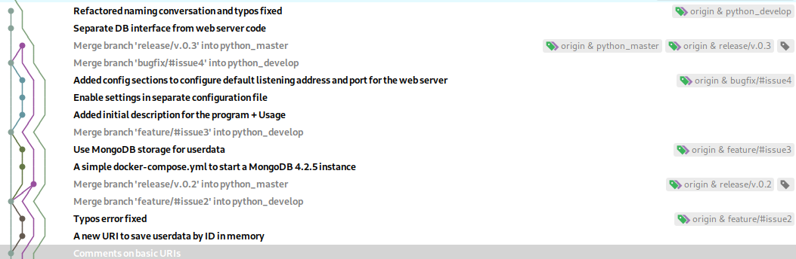

# Step - 2. Development with Git

## Description

Here you can find a simple Python Web server written with Flask framework.

This program can:

- Reply for you at index page
- Store data sent sa JSON with a specific ID.
- Data saved in MongoDB
- Retrieve data from MongoDB by a given ID.

The program uses local MongoDB instance.

## Usage

Start up MongoDB instance

```bash
docker-compose up -d

```

Install Python dependencies

```bash
pip install -r requirements.txt
```

Run the web server

```bash
python app/run.py
```

## Requirements

Make sure you have the following software on your system

- Git
- Python 3.8
- docker + docker-compose
- Either of the following IDE:
  - Visual Studio Code
  - Jetbrains Pycharm Community

## Exercise

In this repository you can find out a simple Python web microservice. Git flow is used as branching model. However,
the last release is not finished yet.



- The starting commit: c48ae1c6
- Ending commit: 212ea477 (development branch python_develop)

You have to complete the next release (the next release branch - python_master) and push repository into GitHub and GitLab.

Your tasks:

1. Read theoretical material.
2. Register in GitHub and GitLab, create public empty repositories.
3. Repeat all commits using `git flow` branch model, describe the meaning for each of branch.
4. Run the microservice  code, add comments if required.
5. Complete the next release.
6. Add new remotes (targets are GitHub and GitLab) and push your changes.

## Short introduction into Git

There are two types of version-control systems:

- Centralized
- Decentralized

Each file changes in a Git repository can be in 4 states:

- Untracked
- Unmodified
- Modified
- Staged


Key features:

- Git storage snapshots of changes
- Each commit has its unique checksum

Main Git objects [link](https://www.oreilly.com/library/view/version-control-with/9781449345037/ch04.html)

- **Blobs** - Each version of a file is represented as a blob. Blob, a contraction of “binary large object,” is a term that’s commonly used in computing to refer to some variable or file that can contain any data and whose internal structure is ignored by the program. A blob is treated as being opaque. A blob holds a file’s data but does not contain any metadata about the file or even its name.
- **Trees** - A tree object represents one level of directory information. It records blob identifiers, path names, and a bit of metadata for all the files in one directory. It can also recursively reference other (sub)tree objects and thus build a complete hierarchy of files and subdirectories.
- **Commits** - A commit object holds metadata for each change introduced into the repository, including the author, committer, commit date, and log message. Each commit points to a tree object that captures, in one complete snapshot, the state of the repository at the time the commit was performed. The initial commit, or root commit, has no parent. Most commits have one commit parent, although later in the book (Chapter 9) we explain how a commit can reference more than one parent.
- **Tags** - A tag object assigns an arbitrary yet presumably human readable name to a specific object, usually a commit. Although 9da581d910c9c4ac93557ca4859e767f5caf5169 refers to an exact and well-defined commit, a more familiar tag name like Ver-1.0-Alpha might make more sense!

Git branching and merging - [link](https://git-scm.com/book/en/v2/Git-Branching-Basic-Branching-and-Merging)

## Best practises with Git

- Follow your branching conversation, they are useful!
- Use meaningful comments - don't add a comment with message "lalalala" or similar!
- Be afraid of deleting commits or files in repositories - better to add another commit than lose your files!
- Don't force pushing if you don't understand consequences!
- Using GUI is ok, don't be suspicious or overconfident.

## Using Branching model - gitflow


